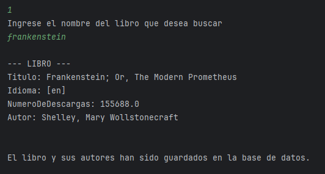
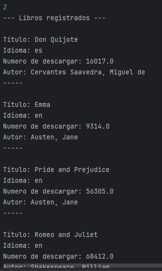
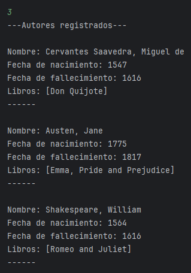
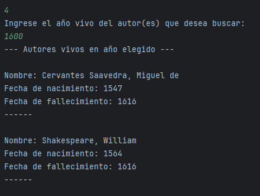
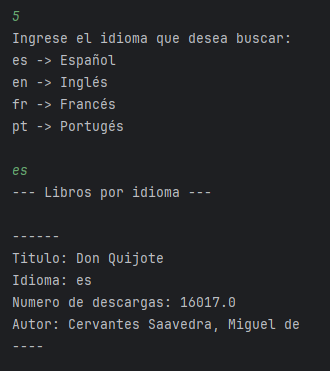

# Biblioteca Interactiva - Menú Principal

Esta aplicación permite a los usuarios gestionar una colección de libros y autores de manera interactiva. El menú principal ofrece diversas opciones para buscar y listar información.

## Menú Principal

A continuación, se detalla el menú principal de la aplicación:

--- MENU ---

Seleccione una opción:

1 - Buscar libros por título

2 - Listar libros registrados

3 - Listar autores registrados

4 - Listar autores vivos en un determinado año

5 - Listar libros por idioma

0 - Salir

## Funcionalidades

## 1. Buscar libros por título

Permite realizar una búsqueda de libros por título. El usuario puede ingresar el título completo o una parte del mismo.

## 2. Listar libros registrados

Muestra un listado de todos los libros disponibles en la base de datos, incluyendo detalles como el título, autor e idioma.

## 3. Listar autores registrados

Presenta una lista de todos los autores registrados en el sistema, incluyendo su información relevante.

## 4. Listar autores vivos en un determinado año

Permite al usuario especificar un año, y la aplicación mostrará todos los autores que estaban vivos en ese año.

## 5. Listar libros por idioma

Filtra y lista los libros disponibles en el sistema según el idioma especificado por el usuario.

## 0. Salir

Termina la ejecución de la aplicación.
